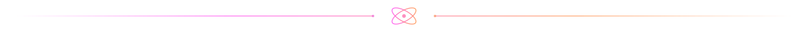

<div align="center">
  

  <a href="https://github.com/YoungJibbit95/Neutron-Client/graphs/traffic"></a>
  <a href="https://github.com/YoungJibbit95/Neutron-Client/graphs/traffic"></a>

  <p>
    <a href="https://github.com/YoungJibbit95/Neutron-Client/releases"></a>
    <a href="https://github.com/YoungJibbit95/Neutron-Client/releases"></a>
    <a href="https://github.com/YoungJibbit95/Neutron-Client/stargazers"></a>
  </p>
  <p>
    <a href="https://github.com/YoungJibbit95/Neutron-Client/actions/workflows/repository-policy.yml"></a>
    <a href="https://github.com/YoungJibbit95/Neutron-Client/actions/workflows/codeql.yml"></a>
  </p>

  <p>
    <a href="https://github.com/YoungJibbit95/Neutron-Client/releases">📥 Downloads</a> ·
    <a href="#installation">📦 Install</a> ·
    <a href="https://github.com/YoungJibbit95/Neutron-Client/issues">🐛 Report a bug</a> ·
    <a href="#development">🛠️ Build</a>
  </p>
</div>

<a name="neutron-client"></a>

# ⚛️ Neutron Client

A Minecraft **1.8.9** hacked client with a focus on modern and customizable visuals, a good user experience and good performing simple bypasses for most servers.

**🎯 Focus:** Intave and Polar Bypass Research, extended visual systems and good performance on most other anticheats. Bypasses for other anticheats are planned.

<a name="features"></a>

## ✨ Features

- 🖱️ **ClickGUI:** For Client Customization, Module Toggeling and Options, etc. Open with **Right Shift**.
- 🎨 **Themes:** PinkLemonade by default, plus presets and custom colors. Adjust blur, glow and animations.
- 🧭 **HUD:** Target, armor, session and module overlays with layout controls.
- 🧩 **Modules:** Combat, Ghost, Movement, Player, World, Exploit, Client and Render categories.

<div align="center">
  
  <sub>Brand illustrations; game screenshots will follow.</sub>
</div>

<p align="center">
  
</p>

<a name="installation"></a>

## 📦 Installation

**Development preview:** use a tested bundle from [Releases](https://github.com/YoungJibbit95/Neutron-Client/releases). If none is listed, there is no published build yet.

1. Download and extract `Neutron-<version>-bundle.zip`.
2. Copy the **whole `Neutron-<version>` folder**, containing the matching JAR and JSON, into your Minecraft `versions` folder:

   | System | Folder |
   | :-- | :-- |
   | Windows | `%APPDATA%\.minecraft\versions` |
   | macOS | `~/Library/Application Support/minecraft/versions` |
   | Linux | `~/.minecraft/versions` |

3. In the official Minecraft Launcher, choose **Installations → New installation** and select `Neutron-<version>`. Enable **Modded** in the installation filters if needed. Use a **Java 8** runtime.
4. Launch and press **Right Shift**.

> Keep the folder and filenames as downloaded. Use a **separate game directory** for testing. The bundle goes in `versions`, not `mods`.

<p align="center">
  
</p>

<a name="development"></a>

## 🛠️ Development

Use **Temurin 8u482** and **Maven 3.9.15**:

```bash
git clone https://github.com/YoungJibbit95/Neutron-Client.git
cd Neutron-Client
mvn test
mvn -Prelease-bundle package
```

[Development setup](docs/DEVELOPMENT-WORKFLOW.md) · [Release bundles & changelog](docs/RELEASES.md) · [Technical reference](docs/CLIENT_TECH_REFERENCE.md) · [Microsoft sign-in setup](design/microsoft-browser-login.md)

Version tags build a JAR + launcher JSON, ZIP, checksums and a short changelog automatically. Builds are tested in Actions; game and account sign-in checks are still required before publishing a release. [Traffic badge setup](docs/README_ASSETS.md#traffic-badges) is documented separately.

[Contributing](CONTRIBUTING.md) · [Security](SECURITY.md) · [Roadmap and compatibility](docs/PROJECT-DIRECTION.md)

<a name="license"></a>

## 📜 License

[GPL-3.0](LICENSE). Third-party code and assets retain their own terms. Neutron is not affiliated with Mojang or Microsoft. Follow the rules of the servers you play on.

<div align="center">
  
</div>
